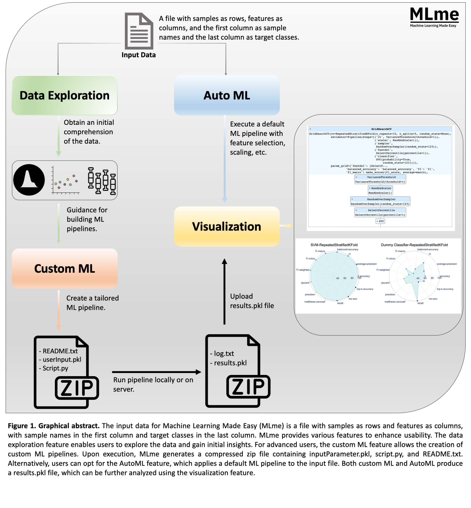
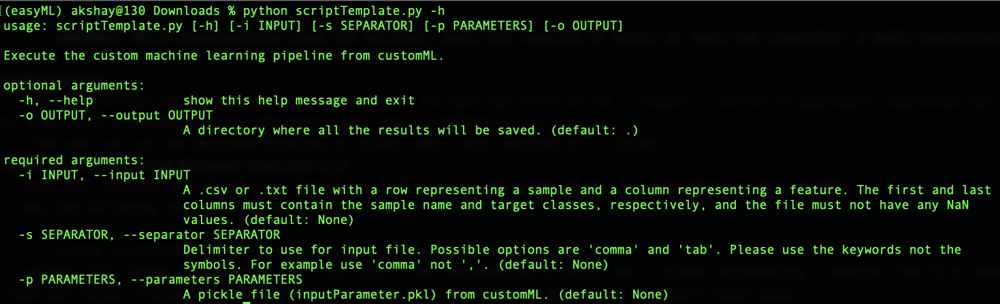

#  

#### Table of contents

- [Summary](#summary)
- [Demo Server](#demo-server)
- [Graphical Abstract](#graphical-abstract)
- [Determining Suitability of MLme for Your Dataset](#determining-suitability-of-mlme-for-your-dataset)
- [Installation (via Docker)](#installation-via-docker)
- [Installation (from source code)](#installation-from-source-code)
    + [Prerequisite](#prerequisite)
    + [Download sourcecode](#download-sourcecode)
    + [Install dependencies](#install-dependencies)
    + [Launch  MLme](#launch-mlme)
    + [Errors you may encounter](#errors-you-may-encounter)
- [Example Input Data](#example-input-data)
- [Tutorial](#tutorial)
  * [Data Exploration](#data-exploration)
  * [AutoML](#automl)
  * [CustomML](#customml)
  * [Visualization](#visualization)

- [Errors you may encounter](#errors-you-may-encounter-1)
 
# Summary
<div style="text-align: right">  This github repo hosts a tool called Machine Learning Made Easy (MLme). By integrating four essential functionalities, namely data exploration, AutoML, CustomML, and visualization, MLme fulfills the diverse requirements of researchers while eliminating the need for extensive coding efforts. MLme serves as a valuable resource that empowers researchers of all technical levels to leverage ML for insightful data analysis and enhance research outcomes. By simplifying and automating various stages of the ML workflow, it enables researchers to allocate more time to their core research tasks, thereby enhancing efficiency and productivity.  </div> 

# Demo Server
We have set up a demo server for MLme for demonstration purposes. Please  [-----]() to launch it. Please note that it may take a moment to load. <br><br> User can use the [example input data](#example-input-data) to test it.

# Graphical Abstract
<p align="center"> </p> 

# Determining Suitability of MLme for Your Dataset
To understand if your data and scientific question fall into the category of a classification problem, there are a few important points to consider:  

  -  Categorized Data: Your data should consist of examples that are grouped into distinct classes or categories. For example, if you're studying different species of plants, each plant should be labeled with its corresponding species name, like "rose" or "tulip.  
  
  -  Prediction Goal: Your scientific question should involve predicting or assigning these labels to new instances based on their features. For instance, you might want to predict the species of a new plant based on its petal length, petal width, and other characteristics.

# Installation (via Docker)
  1. **Prerequisite:** Before proceeding with the installation, ensure that Docker is installed and running. If you haven't installed Docker yet, you can follow the [official Docker tutorial](https://docs.docker.com/get-docker/) for installation instructions.
  2. To obtain the MLme docker image, you may open your terminal and run the provided command.
       
       ```
       docker pull                
       ```
       
  3. To launch MLme, please run the given command in your terminal after performing the previous steps.
       
       ```
       docker run -p 8080:80                      
       ```
       
  4. Paste http://localhost:8080/ in your browser to access MLme.
  
# Installation (from source code)

  - ### Prerequisite 
    
    To use MLme, you must have ```Python``` version ```3.9``` and ```pip``` installed
    and that they are accessible from the terminal.
    
  - ### Download sourcecode 
    Download the GitHub repository and unzip it.
    
  - ### Install dependencies  
    1. Open your terminal and change your current working directory to MLme(e.g. ```cd path/to/MLme/```). 
    2. Please install the required packages using the following command: 
      
       ```pip install -r requirements.txt``` 
       
  - ### Launch MLme
      
       ```python -m main``` 
       
  - ### Errors you may encounter
  
# Example Input Data
  - For ```Data Exploration``` and ```AutoML``` : https://github.com/FunctionalUrology/MLcanvas/blob/main/example-input-data/data-tab-sep.txt
  - For ```Visualization``` : https://github.com/FunctionalUrology/MLcanvas/blob/main/example-input-data/results_for_Visulization.pkl


# Tutorial

  - ## Data Exploration
  
    -  Data Exploration feature allows you to upload your datasets and gain valuable insights through statistical visualizations. By analyzing data patterns, trends, and outliers, you'll be equipped to make informed decisions when developing machine learning pipelines.
        
    -  <i>**Step 1: Input**</i>  
       
       -  Prepare your data in either .csv or .txt format ([Example input data](https://github.com/FunctionalUrology/MLcanvas/blob/main/example-input-data/data-tab-sep.txt)). Each row should represent a sample, and each column should represent a feature. The first column should contain the sample name, and the last column should contain the target classes. Make sure your file doesn't have any missing values (NaN). Here's an example of how your input data should look.
       
            | Sample   | Feature 1 | Feature 2 | Target Class |
            |----------|-----------|-----------|--------------|
            | Sample 1 | 2.5       | 7.8       | A            |
            | Sample 2 | 1.3       | 6.7       | B            |
            | Sample 3 | 4.7       | 3.2       | A            |
  
       
            **Note**: When uploading your file, remember to select the correct separator using the ```Sep``` dropdown menu to avoid any errors. 
   
    -  <i>**Step 2: Output**</i>
       
       -  Once you've uploaded your dataset, you'll have access to various analysis options. You can explore your data in-depth using statistical summary tables and five different types of plots, including density and correlation matrix plots. Simply select the desired option from the ``Plot/Table Type`` dropdown menu.

       -  Additionally, it provides you with the convenience of downloading the plots. Simply click on the camera button provided on each plot to save it for future reference or to share with others.
       
 - ## AutoML
 
   - The AutoML feature aims to provide accessibility to machine learning for all users, including those without technical expertise. It automates the machine learning pipeline, which includes preprocessing, feature selection, and training and evaluating multiple classification models. Additionally, it provides a default dummy classifier for comparison.
  
   -  <i>**Step 1: Input**</i>  
       
       -  Prepare your data in either .csv or .txt format ([Example input data](https://github.com/FunctionalUrology/MLcanvas/blob/main/example-input-data/data-tab-sep.txt)). Each row should represent a sample, and each column should represent a feature. The first column should contain the sample name, and the last column should contain the target classes. Make sure your file doesn't have any missing values (NaN). Here's an example of how your input data should look.
       
            | Sample   | Feature 1 | Feature 2 | Target Class |
            |----------|-----------|-----------|--------------|
            | Sample 1 | 2.5       | 7.8       | A            |
            | Sample 2 | 1.3       | 6.7       | B            |
            | Sample 3 | 4.7       | 3.2       | A            |
  
       
            **Note**: When uploading your file, remember to select the correct separator using the ```Sep``` dropdown menu to avoid any errors. 


    -  <i>**Step 2: Configuration**</i>  
     
       The AutoML feature offers a few configuration options to customize the analysis according to your requirements:
       
       -  ```Variance Threshold```: The ML pipeline includes a variance threshold feature that eliminates low-variance features. You can specify the threshold value to fine-tune the feature selection process.
       
       -  ```No of Features to Select```: Specify the percentage of features you want to select from the original set using the feature selection step. This allows you to focus on the most relevant features.
       
       -  ```Tes Set```: You have the option to allocate a separate test set, comprising 30% of the initial dataset, for evaluating the model's performance. This set is exclusively used for testing and not for training the models.


   -  <i>**Step 3: Output**</i> 
   
      Once the analysis is complete, the AutoML feature provides you with several outputs to assess and interpret the results:
   
       -  ```Evaluation Metrics```: You will receive a table displaying scores for 11 evaluation metrics for six ML algorithms, including SVM, KNN, AdaBoost, GaussianNB, and the dummy classifier. These metrics help you gauge the performance of each algorithm and make informed comparisons.
       
       -  ```Selected Features```: Another table will show the features selected from the original set. This allows you to identify the most important features that contribute to the model's performance.
       
       -  ```Model Performance Visualization```: The feature includes different visualization options, such as spider plots and heatmaps, to help you visualize and interpret the performance of the models. These plots provide a clear understanding of how each algorithm performs across different metrics.
       
       -  ```Pipeline Display```: For a more detailed view, you can explore the pipelines that were executed during the analysis. This includes information about the steps and parameters involved in each pipeline, giving you insights into the underlying processes.
       
       -  ```Downloadable Results```: You can download a zip file that contains a log file and all the results.pkl files. These files capture the detailed results of the analysis. You can upload the results.pkl file to the visualization tab for further analysis and interpretation.
      
      
      
      
 - ## CustomML
 
   -  The CustomML feature is designed for intermediate to advanced machine learning users who want to create a tailored machine learning pipeline to meet their specific requirements. With its user-friendly interface, users can easily design their pipeline by selecting the desired preprocessing steps, classifiers, model evaluation methods, and evaluation metric scores, all through simple toggle buttons. This allows users to focus on selecting the most suitable options for their dataset without the need for programming.
   
   
   
   -  <i>**Step 1: Designing the Pipeline**</i> 
       
       The CustomML feature provides following straightforward interface for designing your pipeline:
      
       -  ```Preprocessing Steps```: You can choose from various preprocessing steps, such as scaling, data resampling, and feature selection. Simply click on the toggle button to include or exclude each algorithm/step in your pipeline.
       
       -  ```Classifier```: Select at least one classifier from the available options by toggling the corresponding button.
      
      -  ```Model Evaluation Method```: Choose the preferred model evaluation method by clicking on the toggle button. This determines how the performance of your model will be assessed.
       
       -  ```Evaluation Metric Score```: Select the desired evaluation metric score for evaluating your model's performance.  
       
       -  ```Customizing Algorithm Parameters```: If you wish to customize the parameters of individual algorithms, click on the ```Parameter``` button. You will be presented with a list of corresponding parameters that you can adjust according to your preferences. If no changes are made, default parameters will be used.
       
       -  ```Pipeline Download```: Once the user has selected the desired algorithms/steps, they can obtain the designed pipeline by clicking on the ```submit``` tab. This will generate a compressed zip file (userInputData.zip) containing README.txt, inputParameter.pkl, and scriptTemplate.py.
       
       **Note**: While preprocessing steps are optional, you must select at least one classifier, a model evaluation method, and an evaluation metric score.


   -  <i>**Step 2: Running the custom-designed pipeline**</i>
     
       To execute your custom-designed pipeline, follow these steps:
       
       - Open your terminal 
       
       - Change your directory to the previously downloaded folder named "userInputData" from the CustomML feature.
       
       - Run the following command in the terminal to execute the pipeline:
       
         ``` python scriptTemplate.py -i path/to/input.csv -p inputParameters.pkl -s tab -o .```
         
         Replace "path/to/input.csv" with the actual path to your input file.

         
        **-> Input file format:** Prepare your data in either .csv or .txt format ([Example input data](https://github.com/FunctionalUrology/MLcanvas/blob/main/example-input-data/data-tab-sep.txt)). Each row should represent a sample, and each column should represent a feature. The first column should contain the sample name, and the last column should contain the target classes. Make sure your file doesn't have any missing values (NaN). You can refer to the example input data for guidance.
       
       
        **-> Tags description:**  These tags provides the usage syntax for running the scriptTemplate.py file. 
        
        ```usage: scriptTemplate.py [-h] [-i INPUT] [-s SEPARATOR] [-p PARAMETERS] [-o OUTPUT]```
        <p align="center"> </p> 
          
          
          
    -  <i>**Step 3: Pipeline Output and Result Interpretation**</i>  
        
        Once you have executed the pipeline, it will generate a compressed zip file as the output. This zip file will contain two important files:
        
        - **log.txt**: This file provides a detailed log of the pipeline execution. It includes information about each step performed during the process, any warnings or errors encountered, and other relevant details.

        - **results.pkl**: This file contains the results of your pipeline, including the model outputs, predictions, and evaluation metrics. It serves as a valuable resource for further analysis and interpretation of your ML model's performance.  


       To interpret the results obtained from your pipeline, follow these steps:  
       
       - Launch MLme and Navigate to the Visualization tab.

       - Upload the results.pkl file that was generated from your pipeline execution.

       - The MLme will process the results and provide visualizations, metrics, and insights to help you understand and analyze the performance of your ML model. You can explore various plots, charts, and summary statistics to gain deeper insights into the model's behavior and effectiveness.


- ## Visualization
 
   -  This feature enables users to effortlessly interpret and analyze their findings with the help of several interactive tables and plots.
   
   -  <i>Input</i>:  
       -  results.pkl file from ```AutoML``` or ```CustomML```. [Example input data](https://github.com/FunctionalUrology/MLcanvas/blob/main/example-input-data/results_for_Visulization.pkl).
       
   -  <i>Output</i>: 
       -  A range of tables and plots are available for comparative analysis of model performance. Users can customize and download all of the plots in high quality, making them suitable for publication.


# Errors you may encounter
  - ``` Following exception occurred: single positional indexer is out-of-bounds```
    - Possible solution: Ensure that you have selected the correct separator using the ```Sep``` dropdown menu.
